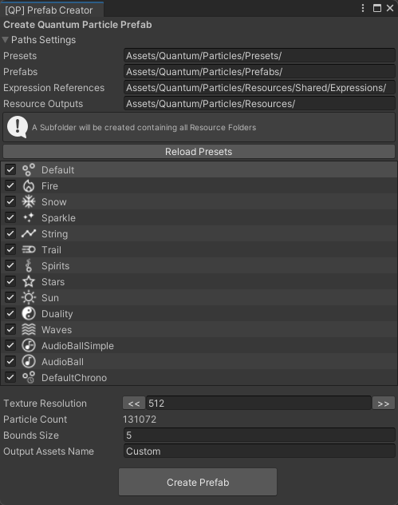

# Avatar Setup

This guide will help you set up the Quantum Particles on your Avatar in VRChat, using either VRCFury or a manual setup method.
If you prefer to watch a video guide instead, check out this one:

## Preparation

First of all, make sure to have a VRChat Unity Project with the latest SDK installed.
After you imported the Quantum Particles package ([Downloads](./downloads/#latest-version)), all the Prefabs can be found in the `Quantum/Particles/Prefabs` folder.

### Third-Party Packages
Depending on your setup method and the features you want to use, you might need to install some additional packages.

- **[AudioLink](https://github.com/llealloo/audiolink/releases)**: Some presets require AudioLink to be installed in your project, the `AudioLink_-.-.-_minimal.unitypackage` is sufficient for this.
- **[VRCFury](https://vrcfury.com/download)**: If you want to use the VRCFury setup, make sure to have the latest version of VRCFury installed in your project.
- **[AV3Manager](https://github.com/VRLabs/Avatars-3.0-Manager)**: If you want to do the manual setup, it is advised to use AV3Manager to merge the Animator Controllers and Parameters.

:::warning
The Quantum Particles are not compatible with the older GPU Particle package or any other repackage like JustSleightly's `ezGPUParticlesv1.5.1` or Bananasaurus Rex's `Brexs_av3.0_GPU_Particles_Setup`.
:::
:::warning
If you are updating from an older version of the Quantum Particles (anything below `v2.0.0`), i recommend to delete the old `Quantum Particles` folder and re-import the package or there might be issues with the new setup.
:::

## Prefabs

### Included Avatar Prefabs

- **[QP Classic]**: The classic Quantum Particles setup.
    - **Presets**: Only Default
    - **Rating**: Good
    - **Triangles**: 43694
    - **Bounds**: 2.5
    - **Mesh Renderers & Material Slots**: 3

- **[QP Basic]**: Contains most simple presets, which do not use additional Meshes or Renderers
    - **Presets**: Default, Fire, Snow, Sparkle, String, Stars, Waves, AudioBallSimple
    - **Rating**: Good
    - **Triangles**: 43694
    - **Bounds**: 2.5
    - **Mesh Renderers & Material Slots**: 3

- **[QP Full]**: Contains all the presets and has therefore the highest performance requirements.
    - **Presets**: Default, Fire, Snow, Sparkle, String, Stars, Waves, AudioBallSimple, AudioBallComplex, AudioBallFull, AudioBallFull
    - **Rating**: Poor
    - **Triangles**: 262154
    - **Bounds**: 5.0
    - **Mesh Renderers & Material Slots**: 21

### Base Setup

- **Quantum Particles**: The base setup for the particles, without any animations or additional components or scripts. Use this one if you want to create your own setup from scratch or plan to use the particles in a different project, like a VRChat World.

### Custom Prefab Creation

The latest version of the Quantum Particles package includes a tool to create your own custom particle prefabs.
These Prefabs can have any combination of the available presets and even adjustable Particle Amounts and Bounds.
To create your own custom Prefab, go to `Tools > Quantum > Particles > Prefab Creator` and you should see a window like this:

**Path Settings:**
At the top, you can specify the Paths where the Prefabs will be saved and also where the reference Resources are located, typically this will only need to be adjusted if you decide to move the `Quantum/Particles` folder.
For every Prefab you create, a new folder in the `Resource Outputs` folder with the name specified at the very bottom will be created.
The Prefabs folder is also expected to contain the reference Prefabs, which are used to create the new Prefab.

**Preset List:**
In the list below, you can choose which Presets you want to include in your Prefab and also drag them into the order you want them to be in (anything unchecked will be skipped in the order).

**Texture Resolution:**
You can change the Amount of particles by adjusting the Texture Resolution with the `<<` and `>>` buttons or changing the value directly in the field between the buttons.
It is advised to use the buttons to increase or decrease the resolution by factors of 2, other resolutions might work but could lead to unexpected results and broken effects.

:::info
Keep in mind that for technical reasons, the amount of particles cannot be adjusted freely.
This is a result of the particle data being stored in a texture, and the amount of particles being determined by the area of this texture.

`Particle_Amount = Resolution_X * Resolution_Y / 2`
:::

**Bounds Size:**
This value will determine the boundary of the particles in all Axes and is centered around the Visualizer GameObject (Typically constrained to be between both simulators).
The particles will only be visible if this boundary is within the camera's view.
Keep it low for a better performance rating but for large scale effects you might want to increase it.

**Output Assets Name:**
This will be the prefix added to most assets created for the Prefab and also the name of the Prefab itself and the Folder containing all of it's Resources.

### Parameter Bits usage: 63
- **48 bits** are used for the particle settings, these can be global or individual (in which case the individual settings will be synchronized with the global parameters - similar concept to parameter compression).
    - SimScale, SimSpeed, Size, Color, Brightness, and Param: **each 8 bits**
- **13 bits** are used for the particle controls, which includes things like the toggle, dropping them, reloading the particles, and the particle type.
    - Toggle, Drop Left, Drop Right, Reload Left, Reload Right: **each 1 bit**
    - Particle Type: **8 bits**

## VRCFury Setup
Make sure to add [VRCFury](https://vrcfury.com/download) to your project.

Simply drag the desired setup prefab from the `Quantum/Particles/Prefabs' folder into your scene hierarchy and then onto your Avatar's root object.
VRCFury will automatically handle the rest, including setting up the particle anchors and the necessary Animator Controllers, Parameters, and Menus.

### Adjustments

You can change the position/rotation of the particle anchors and/or the Bone they are attached to.

1. Unpack the prefab completely (`right click > Prefab > Unpack Completely`).
2. Navigate to the VRCFury Armature Link Script of the Anchor you want to change
3. In the Inspector, you can:
    - change the `Link to (Avatar):` setting to a different bone, like the Left/Right Hand.
    - under `Advanced Options`, you can turn off `Align Position` and/or `Align Rotation` to move the Anchor to your desired position/rotation manually.

:::info Tip
If you want to change the desktop anchor position you can navigate to your Avatar's `Neck` bone and get the Transforms world position (`Copy > World Transform`) and paste it into the `[Neck] Proxy` Anchor Transform (`Paste > World Transform`).
Now you can move the `Desktop Anchor` inside the `[Neck] Proxy` Anchor to your desired position without having to unpack the prefab or modify the VRCFury Scripts.
:::

## Manual Setup

### Default Setup - First Part: Avatar Setup
1. Drag the prefab of your choice into your Unity scene (for base scaling).
2. Right click the prefab in your hierarchy and click **Unpack Prefab**
3. Drag `Quantum Particles` onto your avatar's root object.
4. Drag all the GameObjects inside `>>>MOVE TO ARMATURE BONES<<<` to their corresponding bones on your armature (Left Hand, Right Hand, Neck, Head).
    - You can also move the Left/Right Hand GameObjects to any other bone you prefer, like the Left/Right Index Finger.
5. Reset the **Transform** components of the GameObjects from the previous step by clicking the settings cogwheel in the top right of the Transform component in your Inspector and clicking **Reset**
6. (Optional) Position the Left/Right Hand Anchors to your preference.
7. Select `Desktop Anchor` under `[Neck] Proxy` and position it to your preference (typically at eye/viewpoint level and in front of you at about a distance equal to your arms length)

### Default Setup - Second Part: AV3 Setup
- Depending on the Prefab you chose, all files for these steps can be found under `Quantum/Particles/Resources/<PrefabName>/Expressions`
- It is advised to use something like [AV3Manager](https://github.com/VRLabs/Avatars-3.0-Manager) for the following steps
1. Merge either the `[QP <PrefabName>] Controller` or `[QP <PrefabName>] Controller (IntGestures)` Animator Controller with your Avatars FX Animator Controller, depending on the type of your GestureRight/GestureLeft parameters.
    - If you are unsure, try using `[QP <PrefabName>] Controller (IntGestures)` first, as it is more compatible with other setups.
    - If you have no FX Animator Controller yet, you can use the `[QP <PrefabName>] Controller` as your new FX Animator Controller.
1. Merge the `[QP <PrefabName>] Parameters` with your Avatars Parameters
2. Finally, add a new sub-menu control to your avatar's Menu file and use `[QP <PrefabName>] Quantum Particles` as the target sub-menu
    - You can use the provided `/Quantum/Particles/Resources/Shared/Expressions/Icons/particles` Texture or any other Texture you want as the icon for the sub-menu

